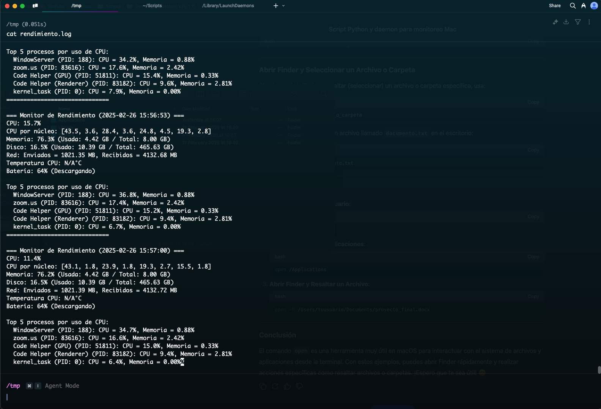
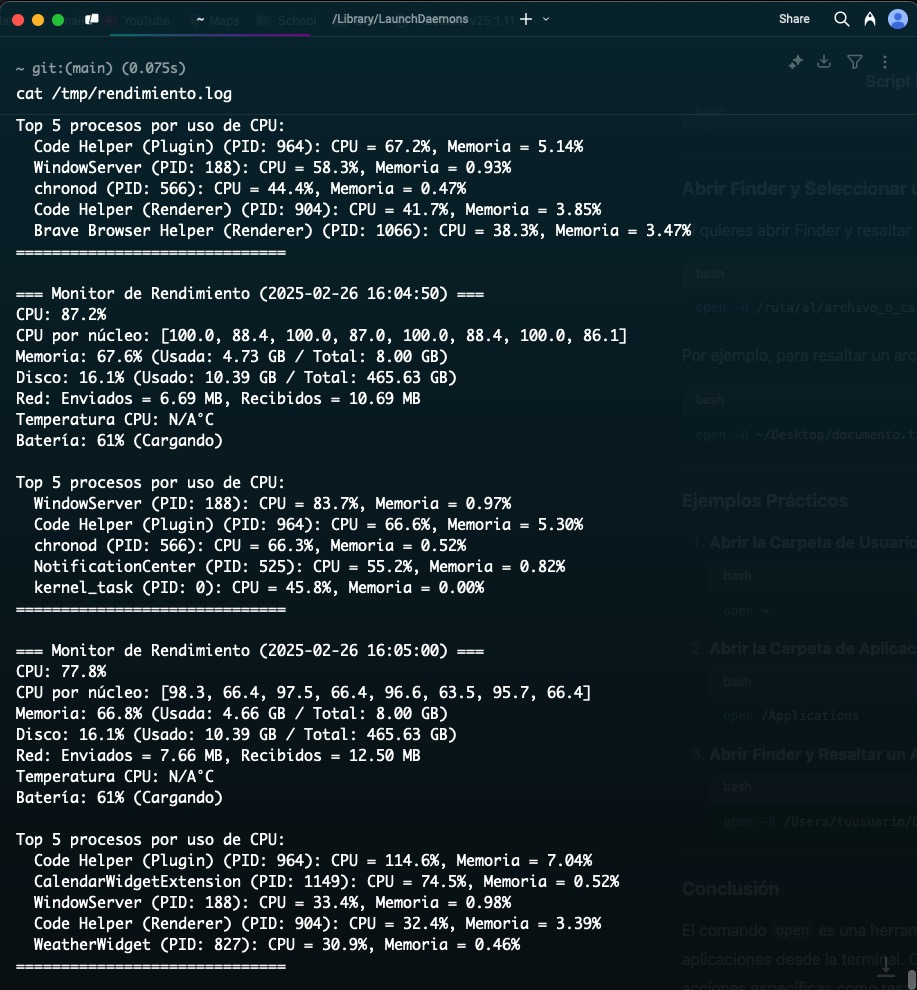
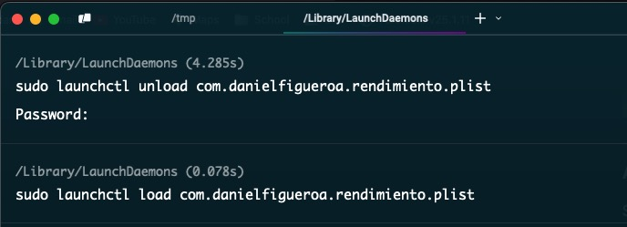

# Monitor de Rendimiento en macOS

Este proyecto es un monitor de rendimiento en tiempo real para macOS, desarrollado en Python. El script obtiene métricas clave del sistema, como el uso de CPU, memoria, disco, red y temperatura, y las muestra en la terminal. Además, se puede configurar como un servicio en segundo plano usando launchd, lo que permite que el monitor esté siempre activo, incluso después de reiniciar el sistema.

## Características
Monitoreo en tiempo real de:

- Uso de CPU (total y por núcleo).
    - Uso de memoria (RAM).
    - Uso de disco.
    - Actividad de red (bytes enviados y recibidos).
    - Temperatura de la CPU (si está disponible).
    - Batería (porcentaje y estado, en laptops).
- Lista de los 5 procesos que más consumen recursos (CPU y memoria).
- Persistencia de logs en archivos para análisis posteriores.
- Configuración como servicio en macOS usando launchd.

## Funcionamiento
### Funcionamiento correcto



### Funcionamiento después de reiniciar



### Logs
El script genera logs en los siguientes archivos:
- **Salida estándar:** /tmp/rendimiento.log
- **Errores:** /tmp/rendimiento_error.log

## Tecnologías Utilizadas
- Python: Lenguaje principal para el desarrollo.
- psutil: Para obtener métricas del sistema.
- launchd: Para ejecutar el monitor como un servicio en macOS.

## Instalación

### Requisitos

- Python 3 instalado.
- La biblioteca psutil para obtener métricas del sistema.
```bash
pip install psutil
```

Asegúrate de que el script tenga permisos de ejecución:
```bash
chmod +x rendimiento.py
```
## Uso

### Ejecución Directa
Para ejecutar el monitor de rendimiento directamente, usa: `python monitor_rendimiento.py`

El script mostrará las métricas en tiempo real y se actualizará cada 5 segundos. Presiona Ctrl + C para detenerlo.

### Configuración como Servicio en macOS
Para ejecutar el monitor como un servicio en segundo plano:

1. Coloca el archivo com.tuusuario.rendimiento.plist en /Library/LaunchDaemons/
2. Asegúrate de que el archivo tenga los permisos correctos: 
```bash
   sudo chown root:wheel /Library/LaunchDaemons/com.tuusuario.rendimiento.plist
```
```bash
   sudo chmod 644 /Library/LaunchDaemons/com.tuusuario.rendimiento.plist```
```
3. Carga el servicio:
```bash
sudo launchctl load /Library/LaunchDaemons/com.tuusuario.rendimiento.plist
```
4. Verifica que el servicio esté en ejecución:
```bash
sudo launchctl list | grep com.tuusuario.rendimiento
```

## Archivos Importantes
- **ejemplos/:** Imágenes de ejemplos para observar la ejecución
- **rendimiento.py:** Código principal del monitor de rendimiento.
- **com.tuusuario.rendimiento.plist:** Archivo de configuración para ejecutar el monitor como un servicio en macOS.
- **/tmp/rendimiento.log:** Logs de salida del monitor.
- **/tmp/rendimiento_error.log:** Logs de errores del monitor.

## Detener el Servicio
Si deseas detener el servicio, usa:

```bash
sudo launchctl unload /Library/LaunchDaemons/com.tuusuario.rendimiento.plist
```



