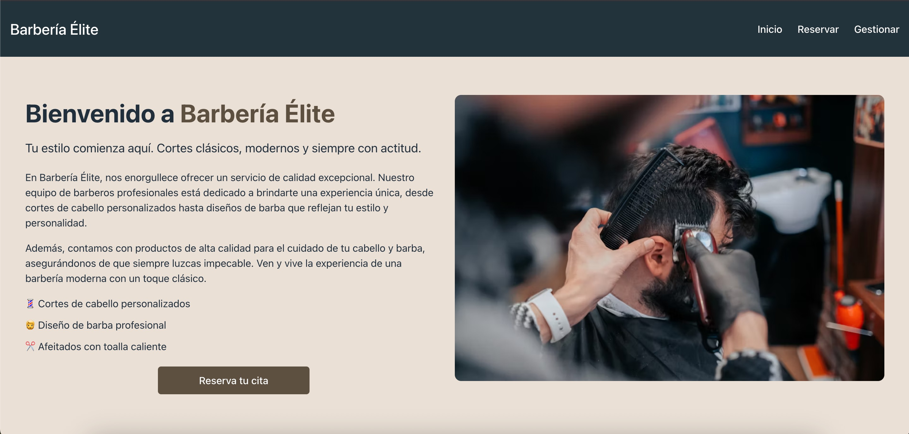
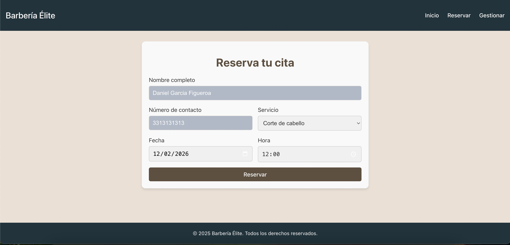
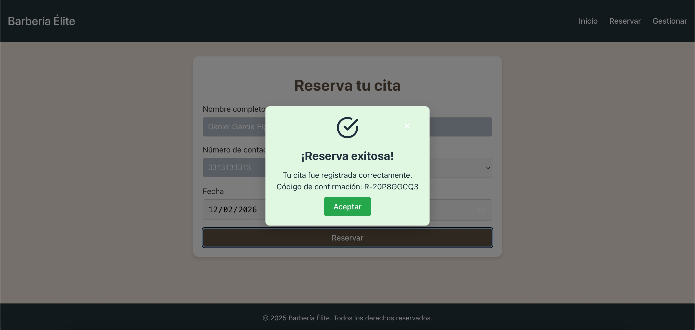
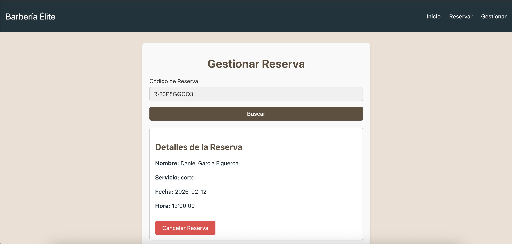
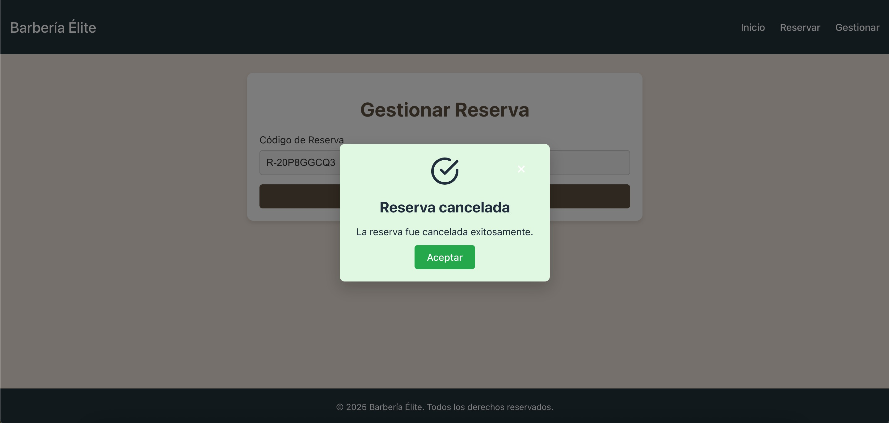

# Sistema de Reservas para Barbería

Este proyecto es un sistema de gestión de citas para una barbería. Está basado en una arquitectura de **microservicios** que permite la gestión de usuarios, reservas y la comunicación con el frontend a través de un API Gateway. El sistema está diseñado para permitir a los usuarios realizar reservas en línea, ver detalles de su cita y gestionar sus datos.

---

## Capturas de Pantalla

A continuación, se muestran algunas vistas clave del sistema:

### Landing Page


---

### Crear Reserva


---

### Reserva Creada


---

### Gestionar Reserva
_Buscar una reserva ingresando el código:_


---

### Cancelar Reserva
_Confirmación y resultado al cancelar una reserva existente:_


---

## Arquitectura

La arquitectura del proyecto está basada en **microservicios**, lo que permite una mayor escalabilidad, mantenibilidad y flexibilidad al desarrollar, desplegar y actualizar los componentes del sistema. Los microservicios que conforman el sistema son los siguientes:

- **Microservicio de Usuarios**: Gestiona los datos de los usuarios (nombre, teléfono, etc.).
- **Microservicio de Reservas**: Permite crear, consultar, actualizar y eliminar reservas para la barbería.
- **API Gateway**: Un servicio que centraliza las peticiones hacia los microservicios y las redirige a los servicios correspondientes.
- **Frontend**: La interfaz de usuario que interactúa con los microservicios a través del API Gateway, permitiendo a los usuarios gestionar sus reservas.

## Estructura del Proyecto

El proyecto está organizado de la siguiente manera:


```plaintext
/07-microservices
├── /microservices-web           # Aplicación Frontend en React
├── /microservices-api           # Aplicación Backend en Node.js
│   ├── /users-service           # Microservicio de gestión de usuarios
│   ├── /reservas-service        # Microservicio de gestión de reservas
│   └── /api-gateway             # API Gateway que centraliza las peticiones
└── docker-compose.yml           # Archivo de configuración para levantar todo con Docker
```

## Tecnologías Usadas

- **Node.js**: El entorno de ejecución para todos los microservicios.
- **Express**: Framework para construir las APIs de los microservicios.
- **Sequelize**: ORM utilizado para interactuar con la base de datos (MySQL).
- **Docker**: Contenerización de los servicios para un despliegue más fácil y controlado.
- **React**: Framework para el frontend que se comunica con los microservicios.
- **CORS**: Configuración para permitir la comunicación entre el frontend y los microservicios.

## Funcionalidades

### Microservicio de Usuarios
El microservicio de usuarios gestiona la creación, actualización y eliminación de usuarios. Cada usuario tiene un identificador único, nombre, teléfono y otras informaciones relevantes. Este servicio permite almacenar y recuperar los datos de los clientes de la barbería.

### Microservicio de Reservas
Este microservicio permite a los usuarios hacer, consultar, actualizar y cancelar sus citas en la barbería. Cada reserva tiene un identificador único, un código, una fecha, hora, y el servicio solicitado. Este microservicio también está conectado al microservicio de usuarios, para vincular las reservas con los clientes que las realizaron.

### API Gateway
El API Gateway es responsable de redirigir las peticiones de los usuarios a los microservicios correspondientes. Funciona como un intermediario entre el frontend y los microservicios de usuarios y reservas. El uso de un API Gateway centraliza la gestión de las APIs y facilita la escalabilidad del sistema.

### Frontend
El frontend es una aplicación construida con React que permite a los usuarios interactuar con el sistema de reservas. Los usuarios pueden ver sus citas programadas y hacer nuevas reservas El frontend se comunica con el API Gateway para acceder a los microservicios.

## Cómo Ejecutar el Proyecto

1. **Clonar el repositorio**

    ```bash
    git clone https://github.com/danfigg/computacion-tolerante-fallas.git
    cd 07-microservices
    ```

2. **Configurar los microservicios**

    Cada microservicio tiene su propio archivo `.env` para configurar las variables de entorno (como la base de datos). Asegúrate de configurar correctamente las credenciales y puertos antes de iniciar los servicios.

3. **Ejecutar con Docker**

    Si prefieres ejecutar los servicios con Docker, puedes usar el siguiente comando para construir y ejecutar los contenedores:

    ```bash
    docker-compose up --build
    ```

    Esto levantará todos los microservicios y el frontend en contenedores Docker.

4. **Ejecutar los microservicios de manera independiente**

    Si prefieres ejecutar los microservicios por separado sin Docker, puedes hacerlo de la siguiente manera:

    - Para el microservicio de **Usuarios**:
    
      ```bash
      cd users-service
      npm install
      npm start
      ```

    - Para el microservicio de **Reservas**:
    
      ```bash
      cd reservas-service
      npm install
      npm start
      ```

    - Para el **API Gateway**:
    
      ```bash
      cd api-gateway
      npm install
      npm start
      ```

    - Para el **Frontend**:
    
      ```bash
      cd microservices-web
      npm run dev
      ```

    Una vez que todos los servicios estén corriendo, puedes acceder al frontend en `http://localhost:3000`.

## Endpoints

### Microservicio de Usuarios
- `POST /users`: Crear un nuevo usuario.
- `GET /users/:id`: Obtener los datos de un usuario por su ID.

### Microservicio de Reservas
- `POST /reservas`: Crear una nueva reserva.
- `GET /reservas`: Obtener todas las reservas.
- `GET /reservas/:id`: Obtener una reserva específica por su ID.
- `DELETE /reservas/:id`: Eliminar una reserva por su ID.

### API Gateway
El API Gateway maneja las peticiones hacia los microservicios de usuarios y reservas. Todas las rutas del frontend pasarán por el API Gateway para acceder a los microservicios.

## Contribuciones

Si deseas contribuir a este proyecto, por favor sigue estos pasos:

1. Haz un fork del repositorio.
2. Crea una nueva rama para tu feature o corrección.
3. Realiza los cambios y haz commit.
4. Abre un pull request describiendo los cambios que realizaste.

## Licencia

Este proyecto está bajo la licencia MIT.